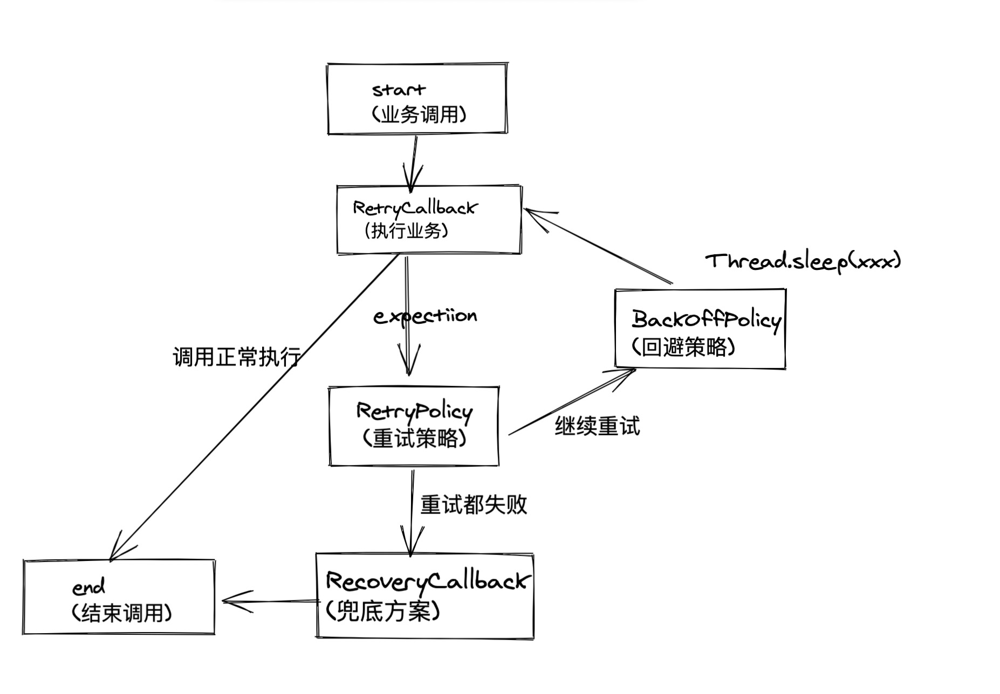

# 框架来解决优雅重试-spring retry
## 重试的意义
To make processing more robust and less prone to failure, it sometimes helps to automatically retry a failed operation, in case it might succeed on a subsequent attempt. Errors that are susceptible to this kind of treatment are transient in nature. For example, a remote call to a web service or an RMI service that fails because of a network glitch or a DeadLockLoserException in a database update may resolve itself after a short wait.  这句话来至于[spring-retry](https://github.com/spring-projects/spring-retry) 的github文档. 总之一句话就是 (为了使处理更加健壮，减少失败的可能性，有时候自动重试失败的操作会有所帮助).有时候等等估计一会就成功了...


code demo:  [https://github.com/WangJi92/spring-retry-example](https://github.com/WangJi92/spring-retry-example)
### 遇到的问题

最近做项目需要进行同步数据(定时任务),一定要同步成功，不然对于业务会有影响，偶发性的会出现调用接口失败，失败并不是特别多，大概的流程如下: 
* 1、循环的进行远程调用，同步数据。
* 2、记录一下调用失败的记录。
* 3、休眠一段时间
* 4、继续循环调用失败的记录
* 5、如果在调用失败、通过钉钉告警 人工二次调用进行修复。

```java
try {
    // 1、foreach do remote invoke
    // 2、record list error invoke
    // 3、sleep some time
    TimeUnit.MINUTES.sleep(5000);
    // 4、foreach do remote invoke error record
    // 5、record error again and ding talk robot alarm
} catch (InterruptedException e) {
}
```
这里也做了一些优化:
将之前的递归调用远程->然后报存数据转换为通过递归转队列,来一个处理一个报错，方便记录调用失败的数据，同时不至于有一个失败所有的之前调用都没有保存且占用内存空间。
增加记录失败，然后休眠一段时间进行补偿，还是不成功，钉钉告警通知。
由于偶发性的会出现调用接口失败，失败还是比较低,上线后没有收到过补偿之后都修复好勒


缺点：实现不够优雅，如果第二次还是失败怎么办？可复用的成本比价低，每个业务都需要写一遍这种增强可靠性的业务逻辑。
### 重试需要什么？

- 出现什么场景需要重试(重试源头)？ 抛出xxx异常或者返回结果为x 需要重试。
- 重试的策略是什么(RetryPolicy)？ 无限重试？最多重试几次、指定的时间范围内可以重试、或者多种重试策略组合。
- 重试的要休眠多久(BackOffPolicy)？每次都休眠固定的时间、第一次1s 第二次2s 第三次4s 、随机的休眠时间。
- 兜底方案(Recover) 如果所有的重试都失败了、兜底方案是什么？有点类似限流,最差返回你系统繁忙的界面。


这些都是重试框架需要解决的问题，需要通过定义模型去解决以上的问题
## spring retry
[spring retry](https://github.com/spring-projects/spring-retry) 提供了注解和编程 两种支持,通过异常失败是否需要重试。提供了 RetryTemplate 支持，类似RestTemplate，使用非常的简单方便
### 基本使用
[Spring Retry 的使用和原理](https://blog.csdn.net/a742172349/article/details/106199939)
[Spring-Retry定制化你的RPC重试](http://kriszhang.com/spring-retry/)


### 核心概念

- RetryPolicy 重试策略

SimpleRetryPolicy    最大次数+特定异常
TimeoutRetryPolicy  超时时间
CircuitBreakerRetryPolicy  熔断+重试 
MaxAttemptsRetryPolicy 最大重试次数


- BackOffPolicy 退避策略

FixedBackOffPolicy 固定时间
ExponentialBackOffPolicy 指数退避策略
ExponentialRandomBackOffPolicy 指数随机退避策略
...

- RetryCallback 业务回调入口
- RecoveryCallback  兜底回调入口

RetryTemplate 执行操作使用,RetryCallback 执行业务逻辑 ,RecoveryCallback 兜底。
```java
public interface RetryOperations {

    <T> T execute(RetryCallback<T> retryCallback) throws Exception;

    <T> T execute(RetryCallback<T> retryCallback, RecoveryCallback<T> recoveryCallback)
        throws Exception;

    <T> T execute(RetryCallback<T> retryCallback, RetryState retryState)
        throws Exception, ExhaustedRetryException;

    <T> T execute(RetryCallback<T> retryCallback, RecoveryCallback<T> recoveryCallback,
        RetryState retryState) throws Exception;

}
```

- RetryListener 重试监听器
- RetryContext 重试上下文
### 业务流程
spring retry 提供了编程式和Aop 注解 两种方式 通过编程式更好理解。
```java
// 获取原始的对象
RetryTestService targetRetryTestService = (RetryTestService) AopTargetUtils.getTarget(retryTestService);

RetryTemplate retryTemplate = RetryTemplate.builder()
    .maxAttempts(2)
    .fixedBackoff(DELAY_TIME)
    .retryOn(RemoteAccessException.class)
    .traversingCauses()
    // 非必须
    .withListener(retryListener)
    .build();

Integer responseBody = retryTemplate.execute(new RetryCallback<Integer, RemoteAccessException>() {

    @Override
    public Integer doWithRetry(RetryContext context) throws RemoteAccessException {
        // 调用业务
        return targetRetryTestService.retryTestService();
    }
}, new RecoveryCallback<Integer>() {
    // 垫底方案
    @Override
    public Integer recover(RetryContext context) throws Exception {
        // 兜底调用业务
        return targetRetryTestService.recover((RemoteAccessException) context.getLastThrowable());
    }
});
log.info("programmingRetry retryTestService response result is {}", responseBody);
```
如下图所示: 执行业务调用 回调 RetryCallback，如果发生了异常，通过RetryPolicy 查看是否可能重试，如果可以重试进行退避休眠策略，如果不行 进行兜底方案调用。

### 常用注解
幕布：[https://mubu.com/doc/5Oq1BHmS4Ba#m](https://mubu.com/doc/5Oq1BHmS4Ba#m)

- @Retryable 

通过注解定义重试策略+退避策略

- @Recover

兜底方案，如果都不成功尝试兜底
第一个参数异常，后续的其他的参数和真实调用保持一致，返回值一致即可。
```java
@Retryable(value = RemoteAccessException.class,
            // 退避策略 休息 5秒继续
            backoff = @Backoff(DELAY_TIME),

            // 重试策略 最大一个两次 包含第一次
            maxAttempts = 2,
            // 兜底方案 全部失败 调用当前类中的兜底方法
            recover = "recover"
    )
public Integer retryTestService() {
    int count = invokeCount.getAndIncrement();
    String url = "http://localhost:8080/unstableApi/500";
    if (count % 2 == 0 && count % 5 == 0) {
        url = "http://localhost:8080/unstableApi/200";
    }
    try {
        ResponseEntity<String> responseEntity = restTemplate.getForEntity(url, String.class);
    } catch (Exception e) {
        log.info("try get unstable api failed", e);
        throw new RemoteAccessException("500", e);
    }
    return 500;
}

/**
     * 作为恢复处理程序的方法调用的注释。合适的恢复处理程序具有Throwable类型（或Throwable的子类型）的第一个参数和与要从中恢复的@Retryable方法相同类型的返回值。Throwable第一个参数是可选的（但是没有它的方法只有在没有其他参数匹配时才会被调用）。后续参数按顺序从失败方法的参数列表中填充
     *
     * @param e
     */
@Recover
public Integer recover(RemoteAccessException e) {
    String stack = Arrays.toString(Thread.currentThread().getStackTrace());
    stack = stack.replaceAll(",", "\n");
    log.info("recover is begin : 堆栈 \n {}", stack);
    ResponseEntity<String> responseEntity = restTemplate.getForEntity("http://localhost:8080/unstableApi/200", String.class);
    log.info("remote response is {}", responseEntity.getBody());
    return Integer.parseInt(Objects.requireNonNull(responseEntity.getBody()));
}
```
### 深入理解
spring retry支持有状态和无状态两种方式。一般理解使用无状态。
【这个理解了好久才理解了】
  对于有状态的可以通过代码实践去理解:  [spring-retry-example](https://github.com/WangJi92/spring-retry-example/blob/master/src/main/java/com/wangji92/retry/springretryexample/task/SchedulingTestStateFullRetryTask.java)

- 无状态:
无状态就是当前线程继续处理，spring retry 通过获取到异常后继续在当前线程重试。
- 有状态:
类比http,http 调用是无状态的，为了增加访问状态可能增加cookie 标识一个人的访问，当前的多次访问是否是一个人;
spring retry 中有状态我这么理解,多次调用不直接的在当前线程重试，将异常抛出,标识为【当前方法参数+方法名称】,记录下当前失败的key对应的记录。
下一次在继续调用对于相同的key可以进行失败统计，如果达到目标失败次数，会调用失败处理的兜底回调org.springframework.retry.RecoveryCallback 进行记录。
[spring retry 中的 stateful 如何使用？](https://www.zhihu.com/question/265289234/answer/952517156)

@CircuitBreaker 是一种有状态的+具有熔断功能 是一个特殊的 @Retryable
可以这么理解由于有状态出现异常直接抛出，第二次调用会记录相同key的失败记录，这里会根据失败次数+熔断，下次调用是否活着兜底方案。


## 总结
多实践实践、才更好的理解，更多参考demo 理解。
通过学习spring retry 理解了框架将相关概念收拢，开发者只需关注核心的逻辑层即可。和写业务类似的，领域建模、内聚业务，单一职责。


- [spring retry](https://github.com/spring-projects/spring-retry)
- [guava-retry](https://github.com/rholder/guava-retrying)
- [http://kriszhang.com/spring-retry/](http://kriszhang.com/spring-retry/)
- [https://blog.csdn.net/a742172349/article/details/106199939](https://blog.csdn.net/a742172349/article/details/106199939)


